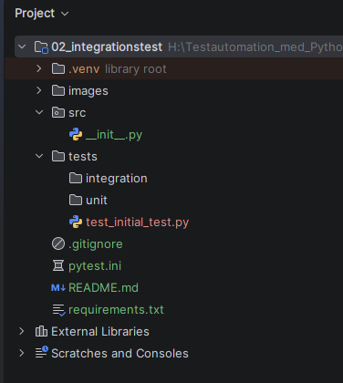

## 0️⃣Projektstruktur
Skapa ett projekt enligt alla konstens regler, på det sätt vi gått igenom på lektionen.

[](images/project_setup.png)

## 1️⃣Diskussion

### Uppgift: 

Integrationstesta ett hotellbokningssystem

Du ska skapa ett enkelt hotellbokningssystem bestående av klasserna:

Guest  
Room  
Payment  
Booking  

Guest ska representera en gäst och innehålla gästens information, exempelvis namn, 
telefonnummer och e-postadress.

Room ska representera ett hotellrum. Ett rum har ett rumsnummer, ett pris och 
information om huruvida rummet är ledigt. Rummet ska kunna bokas och släppas.

Payment ska hantera betalning för en bokning. En betalning ska kunna lyckas 
eller misslyckas.

Booking ska representera en bokning och ansvara för att samordna bokningen av ett 
rum och betalningen.

### Krav på bokningsflödet

En bokning ska följa dessa regler:

    1. Ett ledigt rum ska kunna bokas om betalningen lyckas.
    2. Om betalningen misslyckas ska rummet förbli ledigt.
    3. Ett rum som redan är bokat ska inte kunna bokas igen.
    4. Om rummet redan är bokat ska ingen betalning genomföras.
    5. Vid betalning ska rummets pris användas som betalningsbelopp.

### Integrationstester

Skriv integrationstester som testar interaktionen mellan klasserna, inte bara de 
enskilda klassernas interna funktionalitet.

Testa minst följande scenarier:
1. Lyckad bokning

Ett ledigt rum bokas och betalningen lyckas.

Verifiera att:

- bokningen lyckas
- betalningen genomförs med rätt belopp
- rummet blir upptaget

2. Misslyckad betalning

Ett ledigt rum ska bokas men betalningen misslyckas.

Verifiera att:

- bokningen misslyckas
- betalningen har genomförts med rätt belopp
- rummet fortfarande är ledigt

3. Redan bokat rum

Försök boka ett rum som redan är bokat.

Verifiera att:

- bokningen misslyckas 
- ingen betalning genomförs 
- rummet förblir upptaget

### Testteknik

Använd pytest och använd en spy för att verifiera betalningar (anrop till pay(). Använd en 
fixture för instanser av klassen room. Denna ska finnas i filen "conftest.py".


### Förslag lösning
```
pytest -v -m "task1"
```
Filer:  
hotel\booking.py  
hotel\guest.py  
hotel\payment.py  
hotel\room.py  

Testfiler:  
integration\test_booking_room.py  
integration\test_booking_payment.py

I conftest.py:  
```
@pytest.fixture
def sample_room():
    """
    Creates a payment object for testing.
    """
    return Room(101, 1500)
```

## 2️⃣Anmälningar
```
pytest -v -m "task2"
```
Skriv enhetstest och integrationstest för klasserna:

Event   
def register_new_member() ← integrationstest  
def sign_up() ← enhetstest

MemberService  
def add_member() ← enhetstest, spionera på denna

Filer:  
enrollments\event.py  
enrollments\member_service.py  

Testfiler:  
unit\test_event.py  
unit\test_member_service.py  
unit\test_event_member_service.py

I conftest.py:  
```
@pytest.fixture
def member_service():
    """
    Creates a MembersService object for testing.
    """
    return MemberService()

@pytest.fixture
def sample_event(member_service):
    """
    Creates an Event object for testing.
    """
    return Event("Bergsklättring", member_service)
```


## 3️⃣Kundvagn

```
pytest -v -m "task3"
```
Gör ett integrationstest som kontrollerar att man inte kan lägga till saker som inte 
finns på lager. Integrationstesta add_inventory_item().

Filer:  
shoppingcart\inventory.py  
shoppingcart\shopping_cart.py  

Testfiler:
integration\test_inventory_shopping_cart.py

``` 
    def add_inventory_item(self, item, amount):
        """
        Add an items to the shopping cart
        :param item: item type to add
        :param amount: amount of items to add
        """

        if item not in self.inventory.inventory_items:
            raise ValueError("Item is not in inventory")

        if item.amount_in_stock < amount:
            raise ValueError("Not enough items in stock")

        cart_item = CartItem(
            item.id,
            item.name,
            item.price,
            amount
        )

        self.items_in_cart.append(cart_item) # adds the selected item as a cart item into cart
        item.amount_in_stock -= amount # remove items from inventory
```

I conftest.py:  
```
@pytest.fixture
def sample_inventory():
    """
    Creates an inventory object for testing.
    """
    return Inventory()
```

## 4️⃣Spårbara transaktioner
```
pytest -v -m "task4"
```
BankAccount
def deposit() ← testa denna
logger ska skriva "deposit: ? kr, saldo ? kr"  
def withdraw() ← testa denna om tillräckligt med pengar finns: logger ska skriva 
"withdraw: ? kr, saldo ? kr" annars: "withdraw: kunde inte ta ut ? kr från kontot"  

Logger  
def log() ← spionera på denna
Skriver ut en sträng med print()

Transaction  
def transfer(amount, from_account, to_account) ← testa denna
Överför pengar från ett konto till ett annat, med hjälp av deposit och withdraw, 
om det finns pengar.

Filer:  
transactions\bank_account.py  
transactions\logger.py  
transactions\transaction.py  

Testfiler:
integration\test_bank_account_logger.py
integration\test_bank_account_transaction.py

I conftest.py:  
```
@pytest.fixture
def sample_logger():
    """
    Creates a logger object for testing.
    """
    return Logger()
```


## 5️⃣Betalningar

